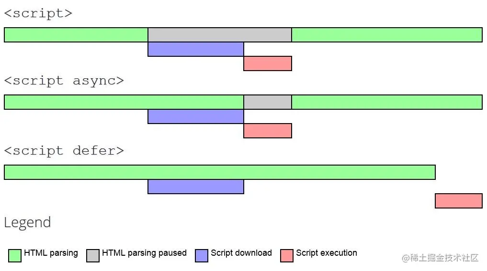

#### 1 script标签：async 和 defer
为防止白屏太长，遇到script 标签with src，浏览器会触发一次渲染，将script标签前的内容渲染出来
单纯script标签，会加载和执行都会阻塞html的解析
async和defer： 加载不会阻塞html解析
- async 脚本加载完成后会立即执行
- defer 脚本加载完成后会等待html解析完成后，按照defer的顺序执行
- link 标签不会阻塞dom树解析，但会阻塞dom渲染，会阻塞之后的js执行（因为js会操作dom的style，但是此时还没有加载完成style）
- inline script会阻塞dom渲染，因为js线程和GUI线程互斥

https://juejin.cn/post/6844903936877395981
#### 2 DNS怎么解析的 of 输入网址会发生什么
https://www.sfn.cn/news/technology/detail/222.html?navId=22
https://zhuanlan.zhihu.com/p/133906695
#### 3 有序数组A和有序数组B，怎么判断B是A的子集
```
def isSubset(A, B):
    i, j = 0, 0
    while i < len(A) and j < len(B):
        if A[i] == B[j]:
            i += 1
            j += 1
        elif A[i] < B[j]:
            i += 1
        else:
            return False
    return j == len(B)

# 示例用法
A = [1, 2, 3, 4, 5, 6]
B = [2, 4, 6]
print(isSubset(A, B))  # 输出：True

B = [2, 4, 7]
print(isSubset(A, B))  # 输出：False

```
#### 4 有哪些宏任务
1. 定时器任务（setTimeout、setInterval）：通过指定的时间间隔触发执行的任务。
2. DOM 事件处理程序：处理用户交互事件（如点击、滚动、键盘输入等）的任务。
3. XMLHttpRequest 和 Fetch 请求：发送网络请求并处理响应的任务。
4. 文件读写操作：读取或写入文件的任务。
5. Web Workers：在后台线程中执行的任务。
6. requestAnimationFrame：在下一次浏览器重绘之前执行的任务，用于实现流畅的动画效果。
7. I/O 操作：执行输入/输出操作的任务，如读取文件、处理数据库等。

常见的微任务包括 Promise 的回调函数（then、catch、finally）、MutationObserver 和 process.nextTick（Node.js 环境下）等。
#### 5 https
#### 防抖和节流