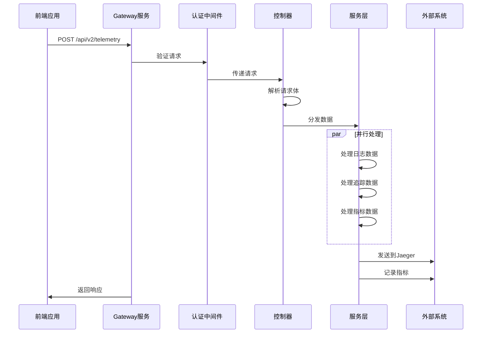

# Gateway 项目架构分析

## 项目概述

这是一个基于 **Fastify** 框架构建的 **ShopeePay 前端报告网关服务**，主要用于处理遥测数据（telemetry data），包括日志、追踪和指标数据。

## 架构图

```mermaid
graph TB
    subgraph "外部客户端"
        Client[前端应用]
    end
    
    subgraph "Gateway 服务"
        subgraph "API 层"
            API1[/api/v1/telemetry]
            API2[/api/v2/telemetry]
            API3[/apiv2/v1/telemetry]
            API4[/apiv2/v2/telemetry]
            Health[/api/health_check]
        end
        
        subgraph "控制器层"
            TelemetryV1[telemetryV1.ts]
            TelemetryV2[telemetry.ts]
        end
        
        subgraph "中间件层"
            Auth[认证中间件]
            CORS[CORS中间件]
        end
        
        subgraph "服务层"
            LogService[日志服务]
            TracingService[追踪服务]
            MetricService[指标服务]
        end
        
        subgraph "共享层"
            ConfigCenter[配置中心]
            Logger[日志工具]
            Utils[工具函数]
            Zeno[性能监控]
        end
        
        subgraph "外部依赖"
            Jaeger[Jaeger 追踪系统]
            CCMS[配置管理系统]
        end
    end
    
    Client --> API1
    Client --> API2
    Client --> API3
    Client --> API4
    Client --> Health
    
    API1 --> TelemetryV1
    API2 --> TelemetryV2
    API3 --> TelemetryV1
    API4 --> TelemetryV2
    
    TelemetryV1 --> Auth
    TelemetryV2 --> Auth
    
    TelemetryV1 --> LogService
    TelemetryV1 --> TracingService
    TelemetryV1 --> MetricService
    TelemetryV2 --> LogService
    TelemetryV2 --> TracingService
    TelemetryV2 --> MetricService
    
    LogService --> Logger
    TracingService --> Jaeger
    MetricService --> Logger
    
    ConfigCenter --> CCMS
    Zeno --> Logger
```

## 核心组件分析

### 1. **API 路由设计**
- **多版本支持**: 同时支持 v1 和 v2 两个API版本
- **路径前缀**: 使用 `/api` 和 `/apiv2` 两种前缀
- **健康检查**: 提供 `/api/health_check` 端点

### 2. **控制器层 (Controllers)**
- **telemetryV1.ts**: 处理 v1 版本的遥测数据
- **telemetry.ts**: 处理 v2 版本的遥测数据
- **功能**: 接收、验证和分发遥测数据到相应的服务

### 3. **服务层 (Services)**
- **日志服务 (log.ts)**: 处理事件日志数据
- **追踪服务 (tracing.ts)**: 处理分布式追踪数据，发送到Jaeger
- **指标服务 (metric/)**: 处理性能指标数据

### 4. **中间件层 (Middlewares)**
- **认证中间件 (auth.ts)**: 请求认证和授权
- **CORS中间件**: 跨域资源共享配置

### 5. **共享组件 (Shared)**
- **配置中心 (configCenter.ts)**: 集成CCMS配置管理系统
- **日志工具 (logger.ts)**: 统一的日志记录
- **Zeno监控 (setupZeno.ts)**: 性能监控和链路追踪
- **工具函数 (utils.ts)**: 通用工具函数

## 技术栈分析

### 核心框架
- **Fastify**: 高性能的Web框架
- **TypeScript**: 类型安全的JavaScript超集

### 关键依赖
- **@shopeepay/ccms-client**: 配置管理客户端
- **@shopeepay/platform-utils**: 平台工具库
- **@zeno/agent-profiler**: 性能分析工具
- **pino**: 高性能日志库
- **prom-client**: Prometheus指标客户端

### 外部集成
- **Jaeger**: 分布式追踪系统
- **CCMS**: 配置管理系统
- **Prometheus**: 指标监控系统

## 数据流分析



## 架构特点

### 优势
1. **高性能**: 使用Fastify框架，支持高并发
2. **可扩展**: 模块化设计，易于扩展新功能
3. **多版本支持**: 支持API版本管理
4. **监控完善**: 集成多种监控和追踪工具
5. **配置管理**: 支持动态配置更新

### 设计模式
1. **分层架构**: 清晰的控制器-服务-共享层分离
2. **中间件模式**: 可插拔的中间件设计
3. **依赖注入**: 通过配置中心管理依赖
4. **观察者模式**: 配置变更监听机制

### 运维特性
1. **健康检查**: 提供健康检查端点
2. **日志轮转**: 配置了logrotate
3. **定时任务**: 支持crontab配置
4. **性能监控**: 集成Zeno性能分析

## 部署和运维

### 环境配置
- **开发环境**: 使用ts-node-dev进行热重载
- **生产环境**: 编译为JavaScript后运行
- **内存配置**: 生产环境使用8GB内存限制

### 监控指标
- 网关报告持续时间
- 错误总数统计
- 配置更新监控

这个Gateway服务是一个设计良好的微服务网关，专门用于处理ShopeePay前端的遥测数据，具有良好的可扩展性和可维护性。