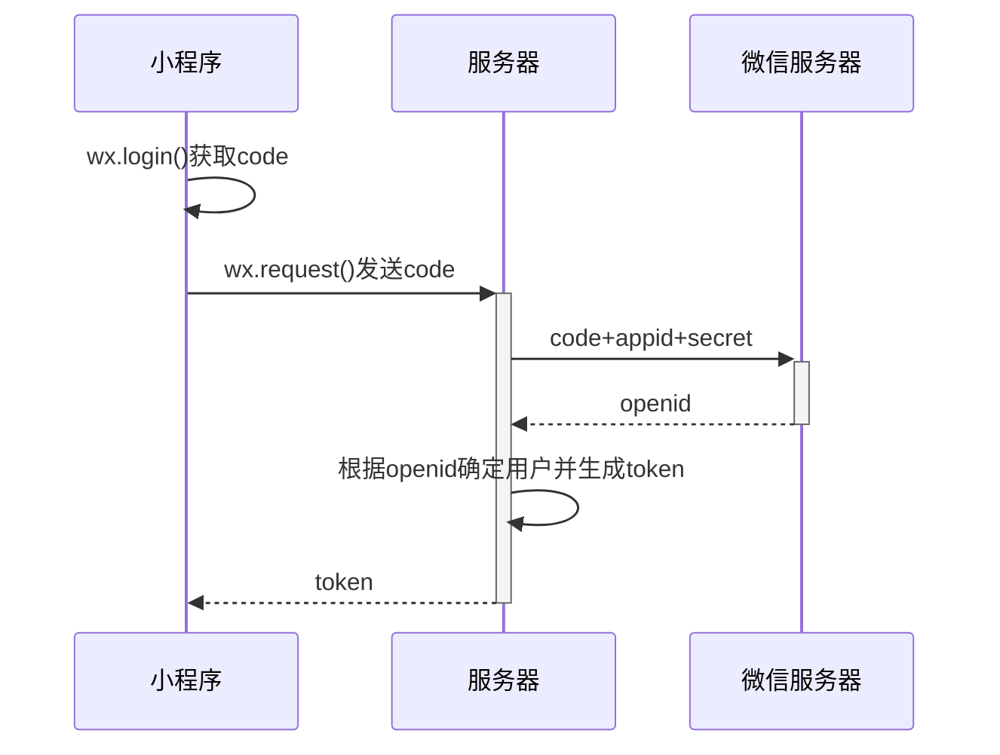
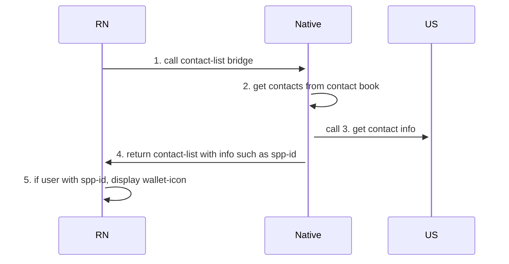
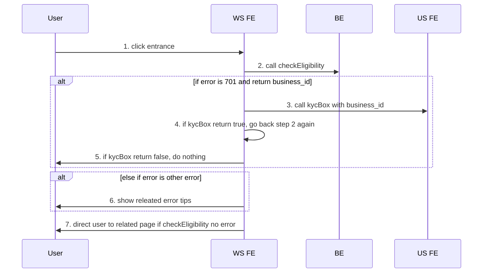

```mermaid
sequenceDiagram
    小程序 ->> 小程序 : wx.login()获取code
    小程序 ->> + 服务器 : wx.request()发送code
    服务器 ->> + 微信服务器 : code+appid+secret
    微信服务器 -->> - 服务器 : openid
    服务器 ->> 服务器 : 根据openid确定用户并生成token
    服务器 -->> - 小程序 : token
```

```mermaid
sequenceDiagram
    RN ->> + Native : 1. call contact-list bridge
    Native ->> + Native : 2. get contacts from contact book
    Native ->> + US : call  3. get contact info 
    Native ->> + RN : 4. return contact-list with info such as spp-id
    RN ->> + RN : 5. if user with spp-id, display wallet-icon
```
3. call /user/v1/batch/get-user-info-by-phone get contact info liking uid

```mermaid
sequenceDiagram
User ->> WS FE: 1. click entrance
WS FE ->> BE: 2. call checkEligibility
	alt if error is 701 and return business_id
		WS FE ->> US FE: 3. call kycBox with business_id
		WS FE ->> WS FE: 4. if kycBox return true, go back step 2 again
		WS FE ->> User: 5. if kycBox return false, do nothing
	end
	alt else if error is other error
		WS FE ->> User: 6. show releated error tips
	end
WS FE ->> User: 7. direct user to related page if checkEligibility no error
```